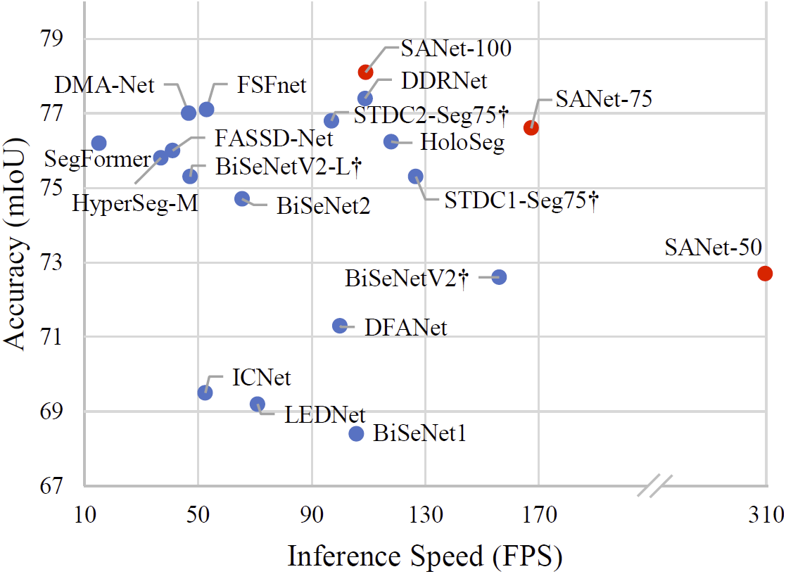
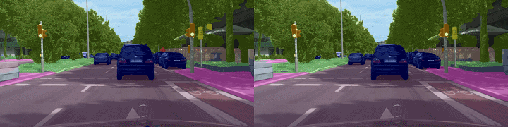
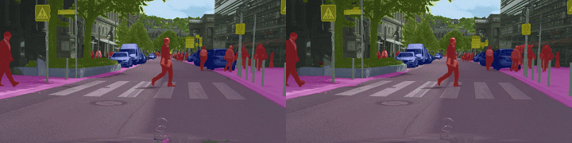
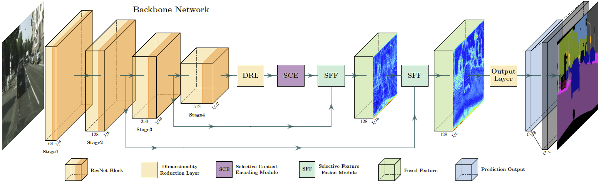
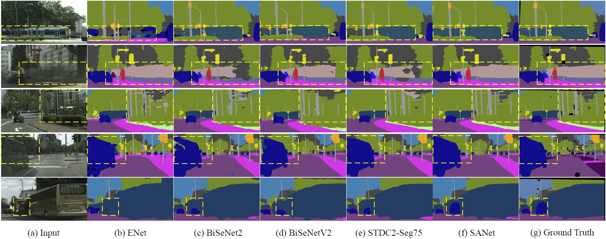
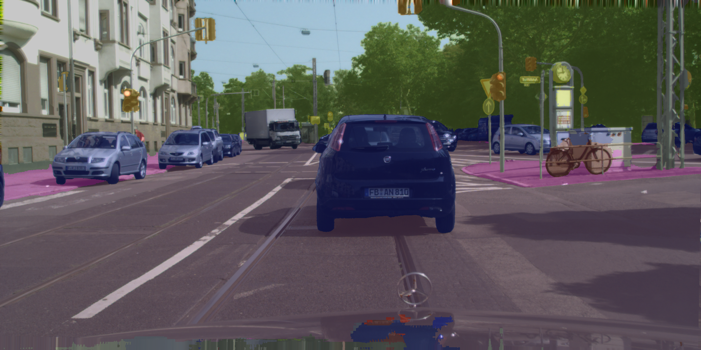

# Exploring Scale-Aware Features for Real-Time Semantic Segmentation of Street Scenes

[](https://opensource.org/licenses/MIT)
[](https://github.com/kaigelee/SANet)
[](https://github.com/kaigelee/SANet)

By Kaige Li, Qichuan Geng, Zhong Zhou. This repository is an official implementation of the paper "Exploring Scale-Aware Features for Real-Time Semantic Segmentation of Street Scenes", which is under review. The full code will be released after review.

## Highlights
<p align="center">
  </br>
  <span align="center">Comparison of inference speed and accuracy for real-time models on test set of Cityscapes.</span> 
</p>

* **Towards Real-time Applications**: SANet could be directly used for the real-time applications, such as autonomous vehicle and medical imaging.
* **A Novel and Efficient Decoder**: a novel Scale-Aware Decoder is introduced to construct features containing scale-specific information for each position via selective context encoding and feature fusion.
* **More Accurate and Faster**: SANet presents 78.1% mIOU with speed of 109.0 FPS on Cityscapes test set and 77.2% mIOU with speed of 250.4 FPS on CamVid test set.


## 🔥 Updates

- Our paper is undergoing a third peer review. In the meantime, we have prepared a preprint and will post a link to it soon. (Jul/26/2023)
- The overview, training logs, and some codes for SANet are available here. (Jul/29/2022)
- We’ve updated how to use TensorRT to accelerate network inference. (Sep/22/2022)
- We find the design of *Real-Time Single Image and Video Super-Resolution Using an Efficient Sub-Pixel Convolutional Neural Network, CVPR 2016* could further improve performance, so we recommend using it to build networks. (Sep/27/2022)
- We open sourced pixelshuffle-based [SANet](https://github.com/kaigelee/SANet/blob/main/models/sanet.py) and [SANet-Tiny](https://github.com/kaigelee/SANet/blob/main/models/sanet_tiny.py). Please note that some hyperparameters of the module still need to be standardized, which we are working on. (Nov/30/2023)


## 🎉 News 

- Good News! I achieved an mIoU of [78.2998](https://www.cityscapes-dataset.com/anonymous-results/?id=4b20f9c0105bedd70b73d5e841ec523f6950314bb65db013c3311674c88e1428) in the newest experbiment by removing Gaussian blur during data augmentation. The experiment is still running and the final mIoU may be even higher! 💪 Now, the data augmentation process includes
  - [x] random cropping
  - [x] random horizontal flipping 
  - [x] random scaling
  - [x] color jitter


## Demos

A demo of the segmentation performance of our proposed SANets: Predictions of SANet-100 (left) and SANet-50 (right).
<p align="center">
  </br>
  <span align="center">Cityscapes Stuttgart demo video #1</span>
</p>

<p align="center">
  </br>
  <span align="center">Cityscapes Stuttgart demo video #2</span>
</p>

## Overview
<p align="center">
  </br>
  <span align="center">An overview of the basic architecture of our proposed Scale-Aware Network (SAFCN). </span> 
</p>
:smiley_cat: SCE and SFF blocks are responsiable for selective context encoding and feature fusion, respectively.


## Metrics

:bell: We plan to embed our method into the robot designed by our research group to improve its ability to understand the scene. Therefore, we will migrate our SANet to TensorRT, and test the speed on embedded systems NVIDIA Jetson AGX Xavier.

:bell: We append 50, 75 and 100 after the network name to represent the input sizes of 512 × 1024, 768 × 1536 and 1024 × 2048, respectively.

| Model (Cityscapes) | Val (% mIOU) | Test (% mIOU)| FPS (RTX 3090) | FPS (RTX 2080<br>Super Max-Q) | FPS (NVIDIA Jetson<br>AGX Xavier(32GB)) |
|:-:|:-:|:-:|:-:|:-:|:-:|
| SANet-50 |  73.7 | 72.7 | 309.7 | 115.1 | 34.3 | 
| SANet-75 | 77.6  | 76.6 | 167.3 | 61.9 |16.4 | 
| SANet-100 | 79.1 | 78.1 | 109.0 | 36.3 |  9.7 | 

| Model (CamVid) | Val (% mIOU) | Test (% mIOU)| FPS (RTX 3090) |FPS (RTX 2080<br>Super Max-Q) | FPS (NVIDIA Jetson<br>AGX Xavier(32GB)) |
|:-:|:-:|:-:|:-:|:-:|:-:|
| SANet |-| 77.2 | 250.4 | 98.8 | 26.8|

:smiley_cat: Our method can still maintain better real-time performance on RTX 2080 Super Max-Q.

## Visualization

Our SANet produces higher-quality segmentation results on both large and small objects.

<p align="center">
  </br>
  <span align="center">Qualitative visual comparison against different methods on the Cityscapes Val set, where notably improved regions are marked with yellow dashed boxes. </span> 
</p>

## Setup Environment

For this project, we used python 3.8.5. We recommend setting up a new virtual
environment:

```shell
python -m venv ~/venv/sanet
source ~/venv/sanet/bin/activate
```

In that environment, the requirements can be installed with:

```shell
pip install -r requirements.txt -f https://download.pytorch.org/whl/torch_stable.html
```


## Usage

### 0. Prepare the dataset

* Download the [Cityscapes](https://www.cityscapes-dataset.com/) and [CamVid](http://mi.eng.cam.ac.uk/research/projects/VideoRec/CamVid/) datasets and unzip them in `data/cityscapes` and `data/camvid` dirs.


### 1. Training

* Download the ImageNet pretrained models and put them into `pretrained_models/imagenet/` dir.
* For example, train the SANet on Cityscapes with batch size of 12 on one GPU:
````bash
python tools/train.py --cfg configs/SANet_cityscapes.yaml
````
* Or train the SANet on Cityscapes using train and val sets simultaneously with batch size of 12 on one GPU:
````bash
python tools/trainval.py --cfg configs/SANet_cityscapes_trainval.yaml
````

### 2. Evaluation

* Download the finetuned models for Cityscapes and CamVid and put them into `pretrained_models/cityscapes/` and `pretrained_models/camvid/` dirs, respectively.
* For example, evaluate the SANet on Cityscapes val set:
````bash
python tools/eval.py --cfg configs/SANet_cityscapes.yaml \
                          TEST.MODEL_FILE pretrained_models/cityscapes/SANet_best_model.pt
````
* Or, evaluate the SANet on CamVid test set:
````bash
python tools/eval.py --cfg configs/SANet_camvid.yaml \
                          TEST.MODEL_FILE pretrained_models/camvid/SANet_camvid_best_model.pt
````
* Generate the testing results of SANet on Cityscapes test set:
````bash
python tools/submit.py --cfg configs/SANet_cityscapes_trainval.yaml \
                          TEST.MODEL_FILE pretrained_models/cityscapes/SANet_trainval_best_model.pt 
````

### 3. Speed Measurement

#### 3.0 Latency measurement tools

* If you have successfully installed [TensorRT](https://github.com/chenwydj/FasterSeg#installation), you will automatically use TensorRT for the following latency tests (see [function](https://github.com/chenwydj/FasterSeg/blob/master/tools/utils/darts_utils.py#L167) here).
* Or you can implement TensorRT inference based on the guidance of [torch2trt](https://nvidia-ai-iot.github.io/torch2trt/master/usage/basic_usage.html). (recommended)  🔥
* Otherwise you will be switched to use Pytorch for the latency tests  (see [function](https://github.com/chenwydj/FasterSeg/blob/master/tools/utils/darts_utils.py#L184) here).

#### 3.1 Measure the speed of the SANet

* Measure the inference speed of SANet-100 for Cityscapes:
````bash
python models/speed/sanet_speed.py --c 19 --r 1024 2048
````
* Measure the inference speed of SANet for CamVid:
````bash
python models/speed/sanet_speed.py --c 11 --r 720 960
````

### 4. Custom Inputs

* Put all your images in `samples/` and then run the command below using Cityscapes pretrained SANet for image format of .png:
````bash
python tools/custom.py --p '../pretrained_models/cityscapes/SANet_best_model.pth' --t '*.png'
````

You should end up seeing images that look like the following:

<p align="center">
  </br>
  <span align="center">Custom Output. </span> 
</p>


## TODO
- [ ] Refactor and clean code
- [ ] Organize all codes and upload them
- [ ] Release complete config, network and training files


## Acknowledgements

This project is based on the following open-source projects. We thank their
authors for making the source code publically available.

* [PIDNet](https://github.com/XuJiacong/PIDNet)
* [ICNet-pytorch](https://github.com/liminn/ICNet-pytorch)
* [Human-Segmentation-PyTorch](https://github.com/thuyngch/Human-Segmentation-PyTorch)
* [HRNet-Semantic-Segmentation](https://github.com/HRNet/HRNet-Semantic-Segmentation)
* [awesome-semantic-segmentation-pytorch](https://github.com/Tramac/awesome-semantic-segmentation-pytorch)
