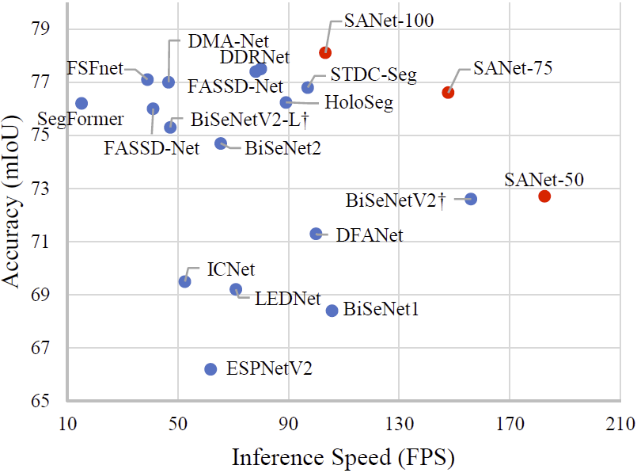

# SANet
By Kaige Li, Qichuan Geng, Zhong Zhou. This repository is an official implementation of the paper "Exploring Scale-Aware Features for Real-Time Semantic Segmentation of Street Scenes", which is under review. The full code will be released after review.

## Highlights
<p align="center">
  </br>
  <span align="center">Comparison of inference speed and accuracy for real-time models on test set of Cityscapes.</span> 
</p>

* **Towards Real-time Applications**: SANet could be directly used for the real-time applications, such as autonomous vehicle and medical imaging.
* **A Novel and Efficient Decoder**: a novel Scale-Aware Decoder is introduced to construct features containing scale-specific information for each position via selective context encoding and feature fusion.
* **More Accurate and Faster**: SANet presents 78.1% mIOU with speed of 103.42 FPS on Cityscapes test set and 77.2% mIOU with speed of 198.5 FPS on CamVid test set.

## Demos

A demo of the segmentation performance of our proposed SANets: Predictions of SANet-100 (left) and SANet-50 (right).
<p align="center">
  </br>
  <span align="center">Cityscapes Stuttgart demo video #1</span>
</p>

<p align="center">
  </br>
  <span align="center">Cityscapes Stuttgart demo video #2</span>
</p>

## Setup Environment

For this project, we used python 3.8.5. We recommend setting up a new virtual
environment:

```shell
python -m venv ~/venv/sanet
source ~/venv/sanet/bin/activate
```

In that environment, the requirements can be installed with:

```shell
pip install -r requirements.txt -f https://download.pytorch.org/whl/torch_stable.html
```

## TODO
- [ ] Refactor and clean code
- [ ] Release complete config, network and training files


## Acknowledgements

This project is based on the following open-source projects. We thank their
authors for making the source code publically available.

* [awesome-semantic-segmentation-pytorch](https://github.com/Tramac/awesome-semantic-segmentation-pytorch)
* [ICNet-pytorch](https://github.com/liminn/ICNet-pytorch)
* [Human-Segmentation-PyTorch](https://github.com/thuyngch/Human-Segmentation-PyTorch)
